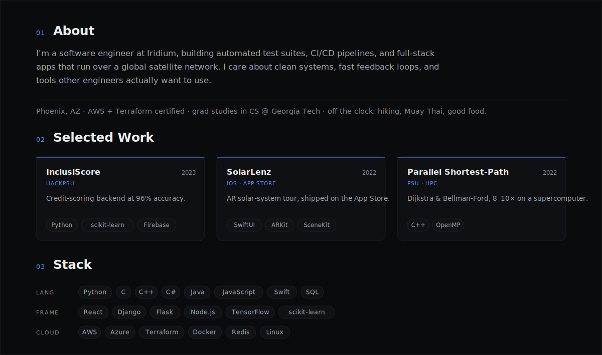

 

[Website](https://davidrohweder.com) &nbsp;·&nbsp; [Résumé](https://davidrohweder.com/David-Rohweder-Resume.pdf) &nbsp;·&nbsp; [LinkedIn](https://www.linkedin.com/in/davidrohweder) &nbsp;·&nbsp; [Email](mailto:david01rohweder@gmail.com)

